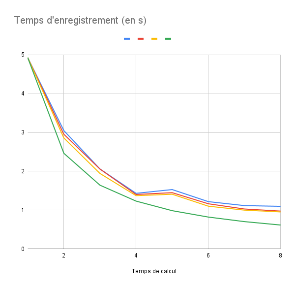
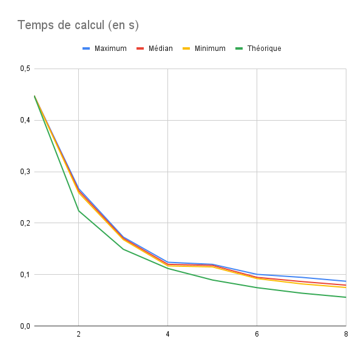

# Examen machine du 21 Mars 2023

## Préambule

Les versions séquentielles des programmes à paralléliser se trouvent avec le dépôt que vous venez de télécharger.

À l'issue de l'examen, vous enverrez les fichiers code source modifiés ainsi qu'un compte-rendu écrit (fichier nommé `README-Nom-Prenom.md`) aux adresses suivantes : 

- xavier.juvigny@onera.fr
- jean-didier.garaud@onera.fr
- augustin.parret-freaud@safrangroup.com

## Introduction

Dans le fichier texte qui accompagne votre travail, répondez aux questions suivantes :

- Quel est le nombre de coeurs physiques de votre machine ?

8
- Quel est le nombre de coeurs logiques de votre machine ?

16
- Quelle est la quantité de mémoire cache L2 et L3 de votre machine ?

Cache L1d : 384 KiB
Cache L1i : 256 KiB
Cache L2 : 10 MiB
Cache L3 : 24 MiB

## Automate cellulaire 1D

Le but de ce programme est d'étudier un automate cellulaire très simple en **une dimension**. Un automate cellulaire consiste en une grille régulière en une seule dimension
pouvant avoir plusieurs "*états*" (ici seulement *allumée* = 1 et *éteinte* = 0) qui seront modifiés selon l'état des cellules voisines (immédiates ou non) en suivant des règles
fixes à chaque itération.

On considère l'automate le plus simple où une cellule donnée n'est influencée que par les cellules adjacentes. Pour une cellule donnée, il existe donc huit "motifs" différents
(les trois cellules pouvant être éteintes ou allumées, soit huit configurations possibles pour une cellule et son voisinage immédiat), précisément les motifs suivants :

| Motif initial (t)              | 111 | 110 | 101 | 100 | 011 | 010 | 001 | 000 |
|--------------------------------|-----|-----|-----|-----|-----|-----|-----|-----|

 On veut donc fixer une règle donnant pour chacun de ces motifs si la cellule concernée devient vivante ou morte à la génération suivante. Il y a donc 2**8 = 256 règles possibles
 qu'on pourra représenter par un nombre binaire dont la valeur entière varie entre 0 et 255.

 Par exemple, la règle numéro trente (en binaire 30 = 00011110) sera:

| Motif initial (t)              | 111 | 110 | 101 | 100 | 011 | 010 | 001 | 000 |
|--------------------------------|-----|-----|-----|-----|-----|-----|-----|-----|
| valeur cellule centrale en t+1 | 0   | 0   | 0   | 1   | 1   | 1   | 1   | 0   |

On veut donc étudier l'influence de ces règles en regardant l'évolution d'une grille de cellule dont au départ toutes sont éteintes sauf une cellule au centre de la grille qui elle sera allumée.

On rajoute de plus une "condition limite" consistant à conserver une cellule à gauche et une cellule à droite qui sera toujours éteinte.

On parcourt ensuite toutes les règles possibles pour générer pour chacune un diagramme "espace-temps" où chaque ligne *i* du diagramme représente un état de la grille au temps *t+i*.

Toujours avec la règle n°30, les trois premières itérations d'évolution de l'automate sont :

| itération   | état        |
|-------------|-------------|
| 0 (initial) | ⬜⬜⬜⬜⬜⬛⬜⬜⬜⬜⬜ |
| 1           | ⬜⬜⬜⬜⬛⬛⬛⬜⬜⬜⬜ |
| 2           | ⬜⬜⬜⬛⬛⬜⬜⬛⬜⬜⬜ |
| 3           | ⬜⬜⬛⬛⬜⬛⬛⬛⬛⬜⬜ |

Pour chaque diagramme calculé, on créée une image ``resultat_*.png`` représentant le diagramme.

### Parallélisation

1. Paralléliser avec MPI le code afin de pouvoir créer l'ensemble des images illustrant les différents diagrammes suivant chacun une règle différente. Justifier dans votre code votre stratégie de parallélisation (statique contre dynamique, à quel niveau j'ai parallélisé, etc.).

Je souhaite implémenter une répartition des règles dès l'initialisation. Par exemple, pour
4 threads :

| 0    | 1      | 2         | 3         |
|------|--------|-----------|-----------|
| 0-63 | 64-127 | 128 - 191 | 192 - 255 |

Étant donné que l'on doit calculer le même nombre d'étapes (il n'y a pas d'autres 
conditions d'arrêts que le nombre d'itérations) puis enregistrer le résultat, je
ne vois pas de raison apriori qui pourrait expliquer que certains processus
soit plus long que d'autres.

2. Créer une courbe donnant l'accélération obtenue avec votre parallélisation (jusqu'à la limite du nombre de coeur physique présent sur votre ordinateur).

Sans parallélisation (sans mpi), le programme prend 0.440092 s pour générer les cellules et 
4,74 s pour enregistrer le résultat.

De plus l'hypothèse que les processus prennent environ la même durée se vérifie : l'écart type des temps de calcul 
est de l'ordre de 4 * 10^{-3} et celle du temps d'enregistrement de 6 * 10^{-2}.

_Remarque :_ Pour Thread=1, cela correspond à un seul thread avec mpi.

**Remarque** : Pour vérifier si les images contiennent des erreurs ou non, on peut vérifier que les fichiers images sont les mêmes qu'avec le code séquentiel en utilisant :

    md5sum -c check_resultats_md.md5sum
ou

    md5sum -c check_resultats_png.md5sum  # si vous avez choisi save_as_png

## Calcul d'une enveloppe convexe

On veut calculer l'enveloppe convexe d'un nuage de point sur le plan. Pour cela on utilise l'algorithme de Graham décrit dans le lien suivant :

    https://fr.wikipedia.org/wiki/Parcours_de_Graham

On obtient en sortie une sous-liste de points du nuage qui définissent l’enveloppe convexe. Ces points sont rangés de manière à parcourir le polygone de l’enveloppe dans le sens direct.

Le code séquentiel peut être trouvé dans le fichier `enveloppe_convexe.py`. En sortie, le code affiche les points et l'enveloppe convexe à l'écran.

Afin de paralléliser le code en distribué avec MPI, on veut distribuer les sommets sur plusieurs processus puis utiliser l’algorithme suivant :

- Calculer l’enveloppe convexe des sommets locaux de chaque processus
- Puis en échangeant deux à deux entre les processus les enveloppes convexes locales, calcul sur chacun la fusion des deux enveloppes convexes en remarquant que
l’enveloppe convexe de deux enveloppes convexe est l’enveloppe convexe de la réunion
des sommets définissant les deux enveloppes convexes.

1. Dans un premier temps, mettre en œuvre l’algorithme sur deux processus.

Sans parallélisation, la génération de points prend 0.0172 s et le calcul de l'enveloppe convexe prend
2,9552 s.

J'ai un bug que je n'ai pas réussi à corriger : il manque 3 points dans l'enveloppe convexe. 

2. Dans un deuxième temps, en utilisant un algorithme de type hypercube, de sorte qu’un processus fusionne son enveloppe convexe avec le processus se trouvant dans la direction d, mettre en œuvre l’algorithme sur `2**n` processus.

3. Mesurer les speed ups de votre algorithme en suivant le critère de Amdhal et de Gustafson. Interprétez votre résultat au regard de la complexité de l'algorithme et commentez.

---

### Exemple sur 8 processus

- Les processus 0 à 7 calculent l’enveloppe convexe de leur nuage de points local.
- Le processus 0 et le processus 1 fusionnent leurs enveloppes, idem pour 2 avec 3, 4 avec 5 et 6 avec 7.
- Le processus 0 et le processus 2 fusionnent leurs enveloppes, idem pour 1 avec 3, 4 avec 6 et 5 avec 7.
- Le processus 0 et le processus 4 fusionnent leurs enveloppes, idem pour 1 avec 5, 2 avec 6 et 3 avec 7.

---
